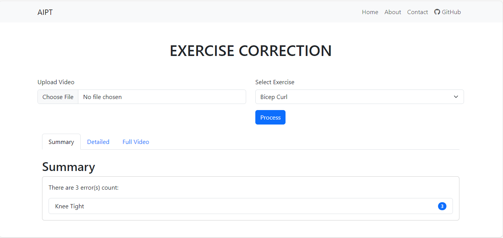
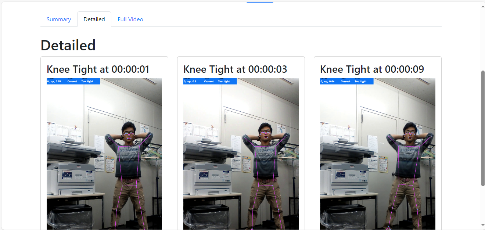
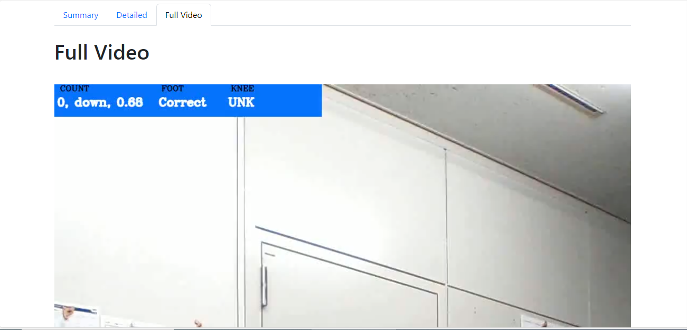

# PBL4: Exercise Correction

<p align="center">
  
</p>

## About The Project

Utilizing the power of Mediapipe’s pose detection, this project aims to analyze, detect, and classify the forms of fitness exercises. The goal is to develop five machine learning models for four common home exercises: Bicep Curl, Plank, Squat, Deadlift, and Lunge. Each model is designed to detect any form of incorrect movement while a person is performing the corresponding exercise. Additionally, a web application will be built to utilize these trained models for analyzing and providing feedback on workout videos.

### Built With

**Data Processing and Model Training:**
- [Numpy](https://numpy.org/)
- [Pandas](https://pandas.pydata.org/)
- [Sklearn](https://scikit-learn.org/stable/)
- [Keras](https://keras.io/)

**Website Development:**
- [Flask](https://flask.palletsprojects.com/en/3.0.x/)

## Dataset
- [Workout/Exercises Video](https://www.kaggle.com/datasets/hasyimabdillah/workoutfitness-video)
- [Fitness-AQA](https://github.com/ParitoshParmar/Fitness-AQA)
- [Squat-dataset](https://hi.cs.waseda.ac.jp/~ogata/Dataset.html)

## Getting Started

This section provides instructions on setting up the project locally.

#### Setting Up Environment

- Python 3.8.13
- Node 17.8.0
- OS: Linux or MacOS

**NOTES**
- ⚠️ Commands/Scripts for this project are written for Linux-based OS. They may not work on Windows machines.

### Installation

If you only want to try the website, refer to the [web README](./web/README.md).

1. Clone the repo and navigate to the project directory:

    ```sh
    git clone https://github.com/PhamQuangNhut/PBL4
    ```

2. Install all project dependencies:

    ```bash
    pip install -r requirements.txt
    ```

3. The **_[core](./core/README.md)_** folder contains the code for data processing and model training.
4. The **_[web](./web/README.md)_** folder contains the code for the website.

## Usage

### 1. Model Training

For detailed information, refer to the [core README](core/README.md).

#### Bicep Curl
- _lean back error_: Confusion Matrix - ROC curve


#### Plank
- _all errors_: Confusion Matrix - ROC curve


#### Basic Squat
- _stage_: Confusion Matrix - ROC curve


#### Lunge
- _knee over toe error_: Confusion Matrix - ROC curve


### 2. Website for Exercise Detection

The web application is for demonstration purposes of all the trained models. Currently, it features one main function: Analyzing and providing feedback on user's exercise videos.

<p align="center">
  
</p>
<p align="center">
  
</p>
<p align="center">
  
</p>
<p align="center">
  
</p>

## Contributing

Contributions are welcome! If you have a suggestion to improve this project, please fork the repo and create a pull request. You can also open an issue with the tag "enhancement". Don't forget to star the project!

1. Fork the Project
2. Create your Feature Branch (`git checkout -b feature/AmazingFeature`)
3. Commit your Changes (`git commit -m 'Add some AmazingFeature'`)
4. Push to the Branch (`git push origin feature/AmazingFeature`)
5. Open a Pull Request

## License

Distributed under the MIT License.

## Acknowledgments

- Inspiration from projects like [Pose Trainer](https://github.com/stevenzchen/pose-trainer), [Deep Learning Fitness Exercise Correction Keras](https://github.com/Vollkorn01/Deep-Learning-Fitness-Exercise-Correction-Keras), and [Posture](https://github.com/twixupmysleeve/Posture).
- [Logo marker](https://www4.flamingtext.com/) for this project.
- This awesome README template is from [Best README Template](https://github.com/othneildrew/Best-README-Template). ♥
